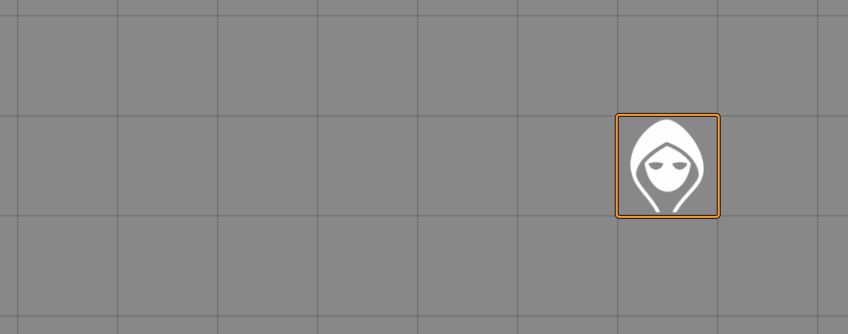

# Sequencer

This module implements a basic sequencer that can be used for managing a flow of a pipeline, like sequencing a set of actions or animations.

The effects created by this module is completely synchronized across all clients thanks to the hard work of U~man over at [FXMaster](https://gitlab.com/mesfoliesludiques/foundryvtt-fxmaster).

## How to use

First you have to define a sequence:

```js
let sequence = new Sequence()
```

Then, you can add functions and effects to it.

```js
let sequence = new Sequence()

sequence.then(async function(){
    do_something();
})

sequence.wait(200)

sequence.then(async function(){
    do_something_else();
})
```

The Sequencer uses a method-chaining fluent interface, meaning you can continiously call functions on the sequence object, like so:

```js
let sequence = new Sequence()
    .then(async function(){
        do_something();
    })
    .wait(200)
    .then(async function(){
        do_something_else();
    })
```

To start the sequence off, you simply call `play()` on the sequence.

## Methods

### Then

`.then(() => {})`

This creates a function that will be called. Remember that if you want your function to be asynchronous and you want it to properly wait, you'll want to make the above:

`.then(async function(){})`

In addition, if you want your function to be `await`ed, you'll need to pass `true` as the last argument in the method call, like so:

`.then(async function(){}, true)`

### Wait

Simple function, it makes the sequence wait at this section for as many milliseconds as you pass to this method.

### Effect

Declares the start of an effect section to be played through FXMaster. From here onwards until `.done()` is called, you'll be working on the Effect section (ie, Then, and Wait does not work here).

#### File

`.file(inPath)`

This declares which .webm to be played

#### Async

`.async(inBool)`

Passing `true` to this method will cause the Sequencer to wait until the effect has finished playing.

#### At Location

`.atLocation(token)` or `.atLocation({ x: 0, y: 0 })`

A smart method that can take a reference to a token or a direct coordinate on the canvas to play the effect at.

#### Aim Towards

`.aimTowards(token)` or `.aimTowards({ x: 0, y: 0 })`

Another smart method (similar to above), which will cause the effect to be rotated towards the given token or coordinates.

#### Scale

`.scale(0.5)` or `.scale({ x: 0.5, y: 1.0 })`

A method that can take a number or an object with x and y for non-uniform scaling of the sprite to be played.

#### Center

`.center()`

This will center the sprite on the given location, effectively giving it an anchor of `{x: 0.5, y: 0.5}`.

**Note:** If this is used, it will override the anchor set by Aim Towards, which is to set the sprite on the outermost edge of the location of the location the sprite is played at.

#### Delay

`.delay(1000)`

This will delay the sprite from being played for a set amount of milliseconds.

## Advanced Example

To get the following result:



You'd have to write something like this:

```js
async function wait(ms){
    return new Promise(resolve => {
        setTimeout(resolve, ms);
    });
}

const token = canvas.tokens.controlled[0];

let data = {
    file: "modules/animated-spell-effects-cartoon/spell-effects/cartoon/electricity/electrivity_blast_CIRCLE.webm",
    position: token.center,
    anchor: {
        x: 0.5,
        y: 0.5
    },
    scale: {
        x: 0.35,
        y: 0.35
    }
};

game.socket.emit("module.fxmaster", data);
await canvas.fxmaster.playVideo(data);

await wait(1000);

let to_location = {
    x: token.center.x-500,
    y: token.center.y
}

let ray = new Ray(token.center, this._to);

data = {
    file: "modules/animated-spell-effects-cartoon/spell-effects/cartoon/electricity/lightning_bolt_RECTANGLE_05.webm",
    position: token.center,
    anchor: {
        x: 0.5,
        y: 0.5
    },
    scale: {
        x: 0.2,
        y: 0.2
    },
    rotation: ray.angle,
    width: ray.distance
};

game.socket.emit("module.fxmaster", data);
await canvas.fxmaster.playVideo(data);

await wait(100);

await token.update({ x: token.position.x-500, y: token.position.y }, { animate: false });

data = {
    file: "modules/animated-spell-effects-cartoon/spell-effects/cartoon/electricity/electric_ball_CIRCLE_06.webm",
    position: token.center,
    anchor: {
        x: 0.5,
        y: 0.5
    },
    scale: {
        x: 0.5,
        y: 0.5
    }
};

game.socket.emit("module.fxmaster", data);
await canvas.fxmaster.playVideo(data);
```

Here's an example using the sequencer instead:

* It plays an effect on a token's location
* Waits for 1 second
* Plays another effect pointing towards 500px to the left of the token
* Waits for 100 milliseconds
* Teleports the token 500px to the left
* Plays another effect on the token's location

```js
let sequence = new Sequence()
    .effect()
        .file("modules/animated-spell-effects-cartoon/spell-effects/cartoon/electricity/electrivity_blast_CIRCLE.webm")
        .atLocation(canvas.tokens.controlled[0])
        .scale(0.35)
        .done()
    .wait(1000)
    .effect()
        .file("modules/animated-spell-effects-cartoon/spell-effects/cartoon/electricity/lightning_bolt_RECTANGLE_05.webm")
        .atLocation(canvas.tokens.controlled[0])
        .aimTowards({
            x: canvas.tokens.controlled[0].center.x-500,
            y: canvas.tokens.controlled[0].center.y
        })
        .scale(0.2)
        .done()
    .wait(100)
    .then(async function(){
        let token = canvas.tokens.controlled[0];
        await token.update({ x: token.position.x-500, y: token.position.y }, { animate: false });
    })
    .effect()
        .file("modules/animated-spell-effects-cartoon/spell-effects/cartoon/electricity/electric_ball_CIRCLE_06.webm")
        .atLocation(canvas.tokens.controlled[0])
        .scale(0.5)
        .done()
```


## Download here:
`https://github.com/Haxxer/FoundryVTT-Sequencer/releases/latest/download/module.json`

## Changelog
*Coming soon*
